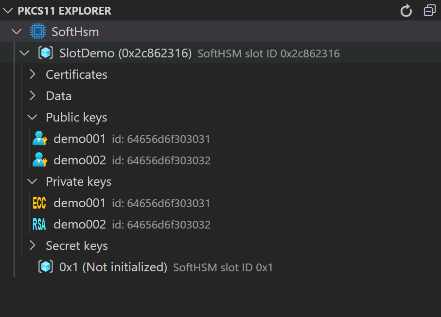

# PKCS11 Explorer extension for Visual Studio Code

A [Visual Studio Code](https://code.visualstudio.com/) [extension](https://marketplace.visualstudio.com/VSCode) with support for [PKCS#11 interface](https://docs.oasis-open.org/pkcs11/pkcs11-base/v2.40/os/pkcs11-base-v2.40-os.html). This extension enables interactionswith cryptographic devices such as HSM (Hardware Security Modules) and smart cards such as
- [SoftHSM2](https://www.opendnssec.org/softhsm/)
- [Thales NShield](https://www.thales-esecurity.com/products-and-services/products-and-services/hardware-security-modules/general-purpose-hsms/nshield-solo)
- [Safenet Luna HSMs](http://www.safenet-inc.com/)
- [RuToken](http://www.rutoken.ru/)  

This extension relies on [PeculiarVentures/pkcs11js](https://github.com/PeculiarVentures/pkcs11js) for interacting with PKCS#11 devices. For a list of all tested devices and capabilities, please visit their [repo](https://github.com/PeculiarVentures/pkcs11js).

## Actions

PKCS#11 Explorer supports the following operations:

- Module
  - Create Slot
  - Get Description
  - Remove Module
- Slot
  - Delete
  - Get description
  - List available mechanisms
  - Initialize
  - Initialize User PIN
  - Set User PIN
- Objects
  - Copy
  - Delete
  - Get attribute
  - Read
  - Rename
- Crypto operations
  - Generate AES/RSA/ECC Key
  - Generate AES/RSA/ECC Key Pair
  - Generate 
  - Sign/Verify
  - Encrypt/Decrypt
  - Digest
  - Export Certificate/Public Key

## Contributing

If you're interested in contributing, or want to explore the source code of this extension yourself, see the [contributing guide](CONTRIBUTING.md)